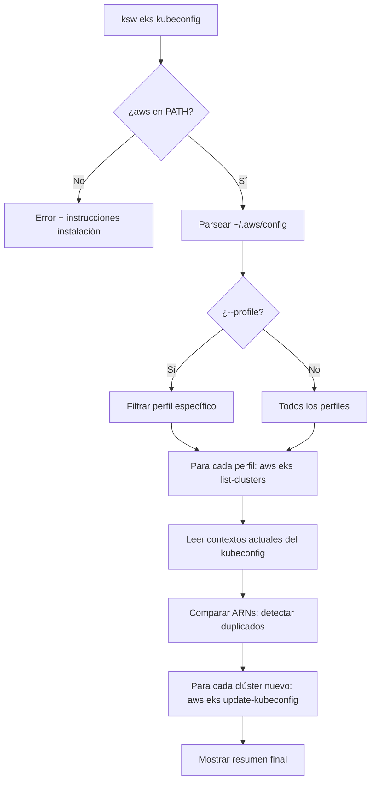

# Documento de Diseño: eks-kubeconfig-sync

## Resumen

Este documento describe el diseño técnico del subcomando `ksw eks kubeconfig`, que sincroniza automáticamente el kubeconfig local con los clústeres EKS disponibles en las cuentas AWS del usuario. El comando lee los perfiles de `~/.aws/config`, descubre clústeres EKS por perfil/región usando `aws eks list-clusters`, detecta duplicados comparando ARNs, y agrega los faltantes con `aws eks update-kubeconfig`.

El código se implementará en un nuevo archivo `eks.go` dentro del mismo paquete `main`, siguiendo el patrón establecido por `ai.go` donde funciones handler se exportan al switch de `main()`.

## Arquitectura

El flujo del comando sigue una pipeline secuencial:



### Decisiones de diseño

1. **Archivo separado `eks.go`**: Sigue el patrón de `ai.go`. Mantiene `main.go` enfocado en routing y TUI.
2. **Sin dependencias nuevas**: Se usa `os/exec` para invocar `aws` CLI, igual que el proyecto hace con `kubectl`. No se agrega el SDK de AWS como dependencia.
3. **Parseo manual de `~/.aws/config`**: El archivo tiene formato INI simple. Se parsea con Go estándar (`bufio.Scanner` + `strings`) sin agregar dependencias de terceros.
4. **Ejecución secuencial por perfil**: Los perfiles se procesan uno a uno. No se paraleliza porque las credenciales AWS pueden requerir interacción (SSO) y el output en terminal debe ser legible.
5. **Comparación por ARN**: El kubeconfig generado por `aws eks update-kubeconfig` incluye el ARN del clúster en el campo `cluster.server` y en el nombre del contexto. Se compara usando el ARN extraído del contexto existente.

## Componentes e Interfaces

### Archivo: `eks.go`

```go
// handleEks es el entry point desde main(), enruta subcomandos de "ksw eks"
func handleEks()

// handleEksKubeconfig ejecuta la sincronización completa
func handleEksKubeconfig(profileFilter string)

// checkAWSCLI verifica que "aws" está en el PATH
func checkAWSCLI() error

// parseAWSProfiles lee ~/.aws/config y retorna los perfiles con su región
func parseAWSProfiles() ([]awsProfile, error)

// getDefaultRegion obtiene la región por defecto de AWS CLI
func getDefaultRegion() string

// listEKSClusters ejecuta "aws eks list-clusters" para un perfil/región
func listEKSClusters(profile, region string) ([]string, error)

// getExistingEKSContexts lee el kubeconfig actual y extrae ARNs de clústeres EKS
func getExistingEKSContexts() (map[string]bool, error)

// buildClusterARN construye el ARN esperado para un clúster dado perfil y región
// Se usa para comparar contra los ARNs existentes en kubeconfig
func buildClusterARN(cluster, region, accountID string) string

// updateKubeconfig ejecuta "aws eks update-kubeconfig" para un clúster
func updateKubeconfig(cluster, profile, region string) error
```

### Integración con `main.go`

Se agrega un nuevo case en el switch de `main()`:

```go
case "eks":
    handleEks()
    return
```

Y se agrega la línea de ayuda en el bloque de `-h`:

```
ksw eks kubeconfig           Sync EKS clusters to kubeconfig
ksw eks kubeconfig --profile <name>  Sync only one AWS profile
```

## Modelos de Datos

### Estructuras

```go
// awsProfile representa un perfil leído de ~/.aws/config
type awsProfile struct {
    Name   string // nombre del perfil (sin el prefijo "profile ")
    Region string // región configurada, o fallback
}

// eksCluster representa un clúster descubierto pendiente de procesar
type eksCluster struct {
    Name    string // nombre del clúster EKS
    Profile string // perfil AWS usado para descubrirlo
    Region  string // región donde se encontró
}

// syncResult acumula los contadores del resumen final
type syncResult struct {
    Added   int // clústeres nuevos agregados al kubeconfig
    Skipped int // clústeres omitidos por ya existir
    Failed  int // clústeres donde update-kubeconfig falló
}
```

### Formato de `~/.aws/config`

El archivo sigue formato INI estándar:

```ini
[default]
region = us-east-1

[profile dev]
region = us-west-2
sso_start_url = https://example.awsapps.com/start

[profile staging]
region = eu-west-1
```

Se parsea extrayendo secciones `[profile <nombre>]` y `[default]`, leyendo la clave `region` de cada una.

### Detección de duplicados

El kubeconfig generado por `aws eks update-kubeconfig` crea contextos con el formato:

```
arn:aws:eks:<region>:<account-id>:cluster/<cluster-name>
```

Para detectar duplicados, se ejecuta `kubectl config get-contexts -o name` y se buscan contextos que contengan el patrón `arn:aws:eks:` seguido de la región y nombre del clúster. Esto evita agregar clústeres que ya tienen un contexto configurado.


## Propiedades de Correctitud

*Una propiedad es una característica o comportamiento que debe mantenerse verdadero en todas las ejecuciones válidas de un sistema — esencialmente, una declaración formal sobre lo que el sistema debe hacer. Las propiedades sirven como puente entre especificaciones legibles por humanos y garantías de correctitud verificables por máquina.*

### Propiedad 1: Round-trip de parseo de perfiles AWS

*Para cualquier* archivo `~/.aws/config` válido que contenga N perfiles con nombres únicos y regiones opcionales, la función `parseAWSProfiles` debe retornar exactamente N perfiles, cada uno con su nombre correcto y la región configurada (o el fallback correspondiente).

**Valida: Requisitos 1.1, 1.2**

### Propiedad 2: Parseo de output de list-clusters

*Para cualquier* lista de nombres de clústeres EKS codificada como JSON (formato de `aws eks list-clusters`), la función de parseo debe retornar exactamente los mismos nombres de clústeres en el mismo orden.

**Valida: Requisito 2.1**

### Propiedad 3: Partición correcta de clústeres nuevos vs existentes

*Para cualquier* conjunto de clústeres descubiertos y cualquier conjunto de contextos existentes en kubeconfig, la función de detección de duplicados debe particionar los clústeres en dos grupos disjuntos (nuevos y existentes) cuya unión es igual al conjunto original, donde un clúster es "existente" si y solo si su ARN aparece en los contextos del kubeconfig.

**Valida: Requisitos 3.1, 3.2, 3.3**

### Propiedad 4: Consistencia de construcción y matching de ARN

*Para cualquier* combinación válida de nombre de clúster, región y account ID, el ARN construido por `buildClusterARN` debe coincidir con el patrón `arn:aws:eks:<region>:<account>:cluster/<name>`, y la función de matching debe reconocer ese ARN como perteneciente al clúster original.

**Valida: Requisito 3.4**

### Propiedad 5: Invariante del resumen de sincronización

*Para cualquier* ejecución de sincronización con N clústeres descubiertos en total, la suma `added + skipped + failed` del `syncResult` debe ser exactamente igual a N.

**Valida: Requisito 4.4**

### Propiedad 6: Filtrado de perfiles por nombre

*Para cualquier* lista de perfiles AWS y un nombre de filtro, si el filtro está vacío se retornan todos los perfiles, y si el filtro tiene un nombre específico se retorna únicamente el perfil con ese nombre (o error si no existe).

**Valida: Requisitos 7.1, 7.3**

## Manejo de Errores

| Escenario | Comportamiento | Código de salida |
|---|---|---|
| `aws` no está en PATH | Mensaje de error con instrucciones de instalación | 1 |
| `~/.aws/config` no existe o no es legible | Mensaje de error descriptivo | 1 |
| No se encuentran perfiles válidos | Mensaje informativo | 0 |
| Credenciales inválidas/expiradas en un perfil | Warning para ese perfil, continúa con los demás | — |
| Error de red/timeout en `aws eks list-clusters` | Warning para ese perfil, continúa con los demás | — |
| `aws eks update-kubeconfig` falla para un clúster | Error para ese clúster, continúa con los restantes | — |
| Perfil `--profile` no encontrado | Mensaje de error indicando perfil no encontrado | 1 |

### Principio de resiliencia

El comando sigue el patrón "best effort": los errores en perfiles o clústeres individuales no interrumpen la ejecución completa. Solo los errores fatales (sin AWS CLI, sin archivo de config) terminan la ejecución inmediatamente.

### Formato de mensajes

Se reutilizan los estilos existentes de `main.go`:
- `successStyle` (✔ verde): clúster agregado exitosamente
- `warnStyle` (✗ rojo): errores y advertencias
- `dimStyle` (gris): clústeres omitidos por duplicado, información secundaria

## Estrategia de Testing

### Tests unitarios

Los tests unitarios cubren casos específicos y edge cases:

- Parseo de archivo AWS config vacío → retorna lista vacía
- Parseo de archivo con perfil `[default]` sin sección `[profile ...]`
- Parseo de perfil sin región → usa fallback `us-east-1`
- Parseo de output JSON de `list-clusters` con lista vacía
- Detección de duplicado cuando el ARN exacto ya existe en kubeconfig
- Filtrado con `--profile` que no existe → error
- Verificación de `aws` en PATH cuando no está disponible

### Tests de propiedades (property-based)

Se usará la librería **[`pgregory.net/rapid`](https://github.com/flyingmutant/rapid)** para property-based testing en Go. Es ligera, no requiere dependencias externas pesadas, y se integra con `go test`.

Cada test de propiedad debe:
- Ejecutar mínimo 100 iteraciones
- Referenciar la propiedad del diseño con un comentario en formato:
  `// Feature: eks-kubeconfig-sync, Property N: <descripción>`

| Propiedad | Test | Generador |
|---|---|---|
| P1: Parseo de perfiles | Generar archivos AWS config aleatorios, parsear, verificar que se extraen todos los perfiles con sus regiones | Generador de perfiles con nombres alfanuméricos y regiones AWS válidas |
| P2: Parseo de list-clusters | Generar listas JSON de nombres de clústeres, parsear, verificar igualdad | Generador de listas de strings alfanuméricos |
| P3: Partición de clústeres | Generar conjuntos de clústeres descubiertos y contextos existentes, verificar partición disjunta y completa | Generador de pares (descubiertos, existentes) con overlap parcial |
| P4: ARN consistente | Generar combinaciones de nombre/región/account, construir ARN, verificar formato y matching | Generador de strings alfanuméricos para cada componente |
| P5: Invariante del resumen | Simular sincronización con resultados aleatorios, verificar suma = total | Generador de tripletas (added, skipped, failed) |
| P6: Filtrado de perfiles | Generar listas de perfiles y filtros, verificar resultado correcto | Generador de listas de perfiles y nombre de filtro opcional |

### Enfoque complementario

- Los **tests unitarios** verifican ejemplos concretos, edge cases y condiciones de error
- Los **tests de propiedades** verifican invariantes universales con inputs generados aleatoriamente
- Juntos proporcionan cobertura completa: los unitarios atrapan bugs concretos, los de propiedades verifican correctitud general
